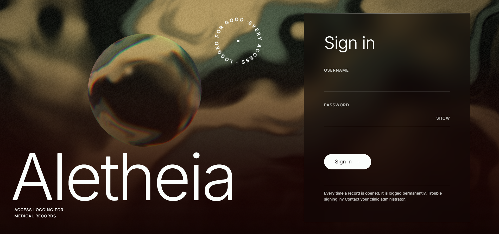

# Aletheia

[](https://github.com/0pStack/Aletheia/actions/workflows/ci.yml)
[](https://nodejs.org)
[](https://www.typescriptlang.org)
[](https://react.dev)
[](https://vite.dev)
[](https://expressjs.com)
[](https://github.com/WiseLibs/better-sqlite3)

Blockchain-backed access logging for medical records — patient data in SQL, every read and write permanently on-chain.

## What it is

A journal system for healthcare, built around one idea: **the record of who looked is worth as much as the record itself.**

Curious staff read the charts of celebrities and neighbours, and a server log can be edited by whoever owns the server. So Aletheia splits the two. The medical data — patients, notes, who wrote them — lives in SQL, where it can be corrected, and never leaves it. Every access to that data becomes an event on a blockchain that the nodes hold together: an id, a role, an action, a timestamp. No names, no personal numbers, no note text ever reach the chain, which is enforced by a test.

The result is a log a patient can read and nobody can quietly rewrite.

### What each role sees

| Role                      | Search | Journal     | Notes they can read           | Write | Access log                       |
| :------------------------ | :----- | :---------- | :---------------------------- | :---- | :------------------------------- |
| Läkare (`DOCTOR`)         | yes    | any patient | `ALL`, `STAFF`, own `PRIVATE` | yes   | yes                              |
| Sjuksköterska (`NURSE`)   | yes    | any patient | `ALL`, `STAFF`, own `PRIVATE` | yes   | yes                              |
| Vårdcentral (`CLINIC`)    | yes    | any patient | `ALL`, `STAFF`, own `PRIVATE` | yes   | yes                              |
| Patient (`PATIENT`)       | no     | their own   | `ALL` only                    | no    | their own                        |
| Obehörig (`UNAUTHORIZED`) | no     | none        | none                          | no    | none — and the attempt is logged |

Hidden notes are filtered in SQL before the response is built, so a note a viewer may not read never reaches their browser at all.

## How it fits together

```
frontend/           React 19 + Vite, three.js for the landing and patient scenes
  └── /api, /ws  ──▶  proxied to a node

backend/            one node; run two on 3001 and 3002
  ├── SQL          patients, users, notes           (the medical record)
  └── chain        access events, sha256 + Merkle   (who looked, and when)
```

Two nodes run side by side on 3001 and 3002 (`npm run dev:node1` / `dev:node2`), connected over WebSocket. A note written on one stays in that node's SQL — the medical text is not replicated. What crosses between nodes is the _access log_, because that is the part that must not depend on trusting a single server.

Distributing blocks between nodes is still being built ([#29](https://github.com/0pStack/Aletheia/issues/29), [#30](https://github.com/0pStack/Aletheia/issues/30), [#39](https://github.com/0pStack/Aletheia/issues/39)). The connection, the chain and the log itself are in place.

The wire format for every endpoint is in [docs/interfaces.md](docs/interfaces.md). Planning and status live in [docs/current-work.md](docs/current-work.md).

## Screenshots



Signing in. The line under the form is the promise the rest of the app keeps: every time a record is opened, it is logged permanently.


Staff arrive here, greeted by name and role, with the search one step away.

_Still to add before hand-in: a journal with its access log, the same record seen by the patient, and the access-denied page._

## Backend setup

Requires Node 24 or later, the version CI runs (`engines` in both `package.json` files says the same). From the project root:

```bash
cd backend
npm install
npm run dev
```

The server listens on http://localhost:3001 (set `PORT` to change it). `GET /api/health` answers when it is up.

| Script                            | What it does                                                      |
| --------------------------------- | ----------------------------------------------------------------- |
| `npm run dev`                     | Start with reload on save (`tsx watch`)                           |
| `npm test`                        | Run the Vitest tests once (`npm run test:watch` to keep watching) |
| `npm run test:coverage`           | Run the tests with coverage; fails below the thresholds           |
| `npm run lint`                    | ESLint                                                            |
| `npm run typecheck`               | TypeScript check without building                                 |
| `npm run format` / `format:check` | Prettier                                                          |
| `npm run build` / `npm start`     | Compile to `dist/` and run it                                     |

`better-sqlite3` is pinned to 12.11 because version 13 compiles from source on install, which fails on Windows without Visual Studio Build Tools. Don't upgrade it until 13 ships prebuilt install binaries again.

## Frontend setup

React 19 + Vite + TypeScript. Requires Node 24 or later, like the backend.

```bash
cd frontend
npm install
npm run dev
```

No `.env` is needed to start: in development the API is mocked by default. Copy `.env.example` to `.env` only to change the settings below.

The dev server runs on http://localhost:5173 and proxies `/api` and `/ws` to `VITE_API_TARGET` (default `http://localhost:3001`), so the session cookie works without CORS.

| Variable          | Default                 | Purpose                                                                          |
| ----------------- | ----------------------- | -------------------------------------------------------------------------------- |
| `VITE_USE_MOCKS`  | `true` in dev           | Set to `false` to call the real backend instead of the MSW mocks in `src/mocks/` |
| `VITE_API_TARGET` | `http://localhost:3001` | Backend node to proxy to (3001 or 3002)                                          |

### Mock logins

The mock data in `src/mocks/data.ts` mirrors `backend/db/seed.ts`, so the [seed accounts](#test-accounts-seed-data) below work with mocks on or off. Shapes and access rules follow [docs/interfaces.md](docs/interfaces.md). If the seed changes, update the mocks to match.

## Test Accounts (Seed Data)

All seeded test accounts use the password: `Password123!`

| Username          | Role           | Linked Patient | Purpose / Access                                                 |
| :---------------- | :------------- | :------------- | :--------------------------------------------------------------- |
| `doctor_dr_house` | `DOCTOR`       | None           | Reads/writes notes, sees `ALL`, `STAFF`, and own `PRIVATE` notes |
| `nurse_jackie`    | `NURSE`        | None           | Reads/writes notes, sees `ALL`, `STAFF` notes                    |
| `clinic_admin`    | `CLINIC`       | None           | Administrative overview / access                                 |
| `patient_anna`    | `PATIENT`      | Anna Andersson | Reads only `ALL` visibility notes for own record                 |
| `unauth_user`     | `UNAUTHORIZED` | None           | Blocked / unverified account testing                             |

Run the seed script from the `backend/` directory:

```bash
npm run db:seed
```

The database file `backend/db/aletheia.db` is gitignored: it is generated output, and every login writes to it. What is versioned is the recipe, `db/schema.sql` and `db/seed.ts`. After cloning, the file is empty until you run the seed, so logins against the real backend fail before that. To reset, stop the backend, delete `aletheia.db` and seed again. Deleting matters because re-seeding an existing file clears the rows but keeps counting ids upward, and the frontend mocks assume the ids of a fresh database (users 1-5, patients 1-3).

## Database

SQLite, through `better-sqlite3`. Four tables; the medical data lives here and only here.

| Table      | Holds                         | Notes                                                   |
| :--------- | :---------------------------- | :------------------------------------------------------ |
| `patients` | name, personal number         | `personal_number` is unique and indexed                 |
| `users`    | login, password hash, role    | `patient_id` links a `PATIENT` account to its record    |
| `notes`    | note text, author, visibility | `PRIVATE` / `STAFF` / `ALL`, filtered in SQL per reader |
| `sessions` | session store                 | defined and indexed, not yet wired up (issue #96)       |

Passwords are hashed with `scrypt` and a per-user salt. Foreign keys are enforced (`PRAGMA foreign_keys = ON`), notes cascade with their patient, and a user who has written a note cannot be deleted.

The create script is [`backend/db/schema.sql`](backend/db/schema.sql), applied by `npm run db:seed`:

<details>
<summary>Show <code>schema.sql</code></summary>

```sql
PRAGMA foreign_keys = ON;

CREATE TABLE IF NOT EXISTS patients (
    id INTEGER PRIMARY KEY AUTOINCREMENT,
    name TEXT NOT NULL,
    personal_number TEXT NOT NULL UNIQUE,
    created_at TEXT NOT NULL DEFAULT (datetime('now', 'utc'))
);

CREATE TABLE IF NOT EXISTS users (
    id INTEGER PRIMARY KEY AUTOINCREMENT,
    username TEXT NOT NULL UNIQUE,
    password_hash TEXT NOT NULL,
    name TEXT NOT NULL,
    role TEXT NOT NULL CHECK (
        role IN ('DOCTOR', 'NURSE', 'CLINIC', 'PATIENT', 'UNAUTHORIZED')
    ),
    patient_id INTEGER UNIQUE,
    created_at TEXT NOT NULL DEFAULT (datetime('now', 'utc')),
    FOREIGN KEY (patient_id) REFERENCES patients(id) ON DELETE CASCADE
);

CREATE TABLE IF NOT EXISTS notes (
    id INTEGER PRIMARY KEY AUTOINCREMENT,
    patient_id INTEGER NOT NULL,
    author_id INTEGER NOT NULL,
    text TEXT NOT NULL,
    visibility TEXT NOT NULL CHECK (
        visibility IN ('PRIVATE', 'STAFF', 'ALL')
    ),
    created_at TEXT NOT NULL DEFAULT (datetime('now', 'utc')),
    FOREIGN KEY (patient_id) REFERENCES patients(id) ON DELETE CASCADE,
    FOREIGN KEY (author_id) REFERENCES users(id) ON DELETE RESTRICT
);

CREATE TABLE IF NOT EXISTS sessions (
    sid TEXT PRIMARY KEY NOT NULL,
    sess TEXT NOT NULL,
    expired INTEGER NOT NULL
);

CREATE INDEX IF NOT EXISTS idx_patients_personal_number
    ON patients(personal_number);

CREATE INDEX IF NOT EXISTS idx_patients_name
    ON patients(name);

CREATE INDEX IF NOT EXISTS idx_notes_patient_id
    ON notes(patient_id);

CREATE INDEX IF NOT EXISTS idx_notes_visibility
    ON notes(visibility);

CREATE INDEX IF NOT EXISTS idx_sessions_expired
    ON sessions(expired);
```

</details>

## Development

`main` is protected: every change reaches it through a pull request with green CI, for everyone including admins. Branch as `feature/<issue>-<short-description>` and put `Closes #<nr>` in the PR description.

Run in each package you touched, before opening the PR:

```bash
npm run typecheck
npm run lint
npm test -- --run
npm run build
```

`npm run format` applies Prettier. CI runs the same checks on `backend` and `frontend` for every PR.

```
frontend/src/
  api/        http client, response envelope, zod schemas, query keys
  app/        router, auth guard, layout, app-level pages
  features/   auth, patients, journal, access-log
  mocks/      MSW handlers for dev and tests
  styles/     design tokens, reset, global styles
  test/       Vitest setup

backend/src/
  auth/       login, session, password hashing
  patients/   search and patient detail
  notes/      note writing and visibility filtering
  access-log/ the chain, read back per patient
  chain/      block, blockchain, Merkle root, keypairs
  config/     port, peers, node id
```

## Who worked on it

|                                                                                    | Track                                                         |
| :--------------------------------------------------------------------------------- | :------------------------------------------------------------ |
| **Ruslan Galiyev** ([@0pStack](https://github.com/0pStack))                        | Frontend — login, patient search, journal, access log, design |
| **Anders Kull** ([@Andkull](https://github.com/Andkull))                           | Chain — blocks, Merkle tree, persistence; database schema     |
| **Bobby Trinh** ([@bobtri](https://github.com/bobtri))                             | Backend — roles, note visibility, audit logging, signing      |
| **Hani Baloch** ([@hanisheksson84-maker](https://github.com/hanisheksson84-maker)) | P2P — node bootstrap, WebSocket server, peer connections      |

Working agreement: [docs/groupcontract.md](docs/groupcontract.md). Standups: [docs/standups/](docs/standups/).

## Credits

Login hero image: [Swirling abstract pattern of green and orange gradients](https://unsplash.com/photos/i-BP0cmbfRo) by [Logan Voss](https://unsplash.com/@loganvoss), used under the [Unsplash License](https://unsplash.com/license).

Team section meerkat: [Meerkat Statue In Garden](https://sketchfab.com/3d-models/meerkat-statue-in-garden-89a756b132134ed3afed6e866dd22289) by [Gypsee](https://sketchfab.com/Gypsee), used under [CC BY 4.0](https://creativecommons.org/licenses/by/4.0/). Modified: ground removed, remeshed, and baked to the distance field in `frontend/public/team/meerkat_64.sdf`.
